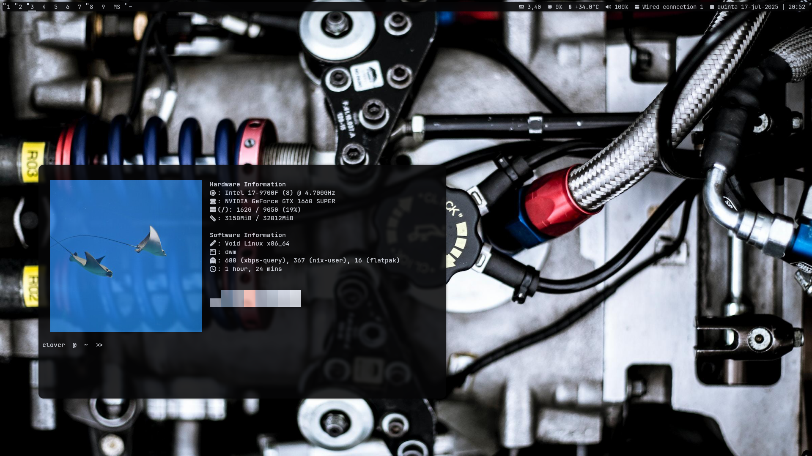
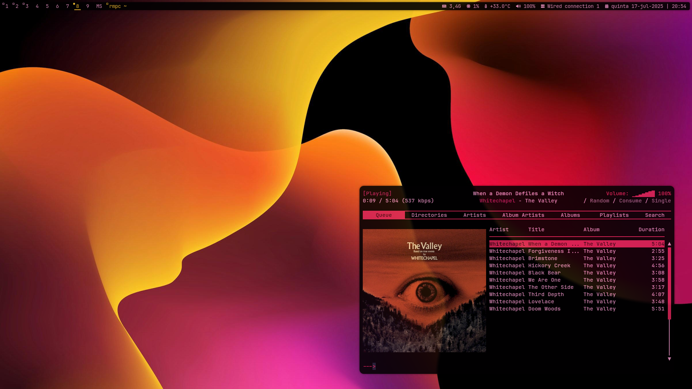

# Void Linux Encrypted Installation Guide without Boot Encryption

This guide is an auxiliary tool to set up Void Linux with disk 
encryption (without boot encryption) on an EFI system. Using an 
unencrypted boot makes the boot process more convenient and faster while
 still protecting all of your files. Theoretically, it makes the system 
more vulnerable if someone that knows what it is doing has access to the
 computer, compared to a full disc encryption. In my use case, I just 
want to protect my files if someone steals my computer.

It also describes how to set some basic features for desktop usage and some that I find useful.

I made it for my use case specifically and what I think works best for my needs.
Hope to help some of you as well :)

Date: jul/2025

### Demo:




### References:

[Full Disk Encryption - Void Linux Handbook](https://docs.voidlinux.org/installation/guides/fde.html)

[A guide to install Void Linux with encrypted root and unencrypted root, with LVM2. (AES-512, LVM) · GitHub](https://gist.github.com/Dko1905/dbb88d092aa973a8ba244eb42c5dd6a6)

## Void Linux Instalation

Download Void Linux and boot through a flash drive.

### Setup work enviroment

Set keyboard layout:

```
$ setxkbmap pt
```

Switch to the root user

```
$ sudo su
```

### Disk preparation and encrypt

List existing drives and find the device path:

```
# fdisk -l
```

Partition the drive:

```
# cfdisk (<device path>)
```

Partition format:

- 1G EFI System (large size if we want to change kernel in the future)

- 2G Linux Filesystem -> Boot (large size if we want to change kernel in the future)

- 100% Linux Filesystem -> root (partition to encrypt)

#### Disk encription

This command encrypts the root partition with AES-512 and luks1 to make sure it works with grub.

```
# cryptsetup luksFormat --cipher aes-xts-plain64 --key-size 512 --hash sha512 --iter-time 4000 --type luks1 /dev/<root_partition>
```

Open the encrypted disk:

```
# cryptsetup luksOpen /dev/<root_partition> voidroot
```

Create the LVM volume group using the encrypted partition.

```
# vgcreate voidroot /dev/mapper/voidroot
```

Create logical volumes. In my case I create an 8G swap, and the rest goes for root.

```
# lvcreate --name swap -L 8G voidroot
# lvcreate --name root -l 100%FREE voidroot
```

Now we make the file system. I use ext4 because it is great for 
general purpose usage. If you work with big volumes of data and move them
 alot xfs might be better in that use case.

```
# mkfs.vfat /dev/<EFI_partition>
# mkfs.ext4 -L boot /dev/<boot_partition>
# mkfs.ext4 -L root /dev/voidroot/root
```

Make a swap file system.

```
# mkswap /dev/voidroot/swap
# swapon /dev/voidroot/swap
```

Moving to the installation, we need to mount the disk first in the following order.

```
# mount /dev/voidroot/root /mnt             -> Mount root
# mkdir -p /mnt/boot                        -> Create mount point for boot
# mount /dev/<boot_partition> /mnt/boot     -> Mount boot
# mkdir -p /mnt/boot/efi                    -> Create EFI mount point
# mount /dev/<EFI_partition> /mnt/boot/efi/ -> Mount EFI
```

Copy the RSA keys from the installation medium to the target root directory.

```
# mkdir -p /mnt/var/db/xbps/keys
# cp /var/db/xbps/keys/* /mnt/var/db/xbps/keys/
```

### Void Linux installation and setup with chroot

For EFI systems using the main glibc repo, this is the install command plus neovim to help edit some files, and dbus NetworkManager to access to an internet connection.

```
# xbps-install -Sy -R https://repo-default.voidlinux.org/current -r /mnt base-system cryptsetup grub-x86_64-efi lvm2 neovim dbus NetworkManager
```

Generate fstab (Filesystem Configuration).

```
# xgenfstab /mnt > /mnt/etc/fstab
```

#### Enter chroot

```
# xchroot /mnt
```

Configure / directory.

```
[xchroot /mnt] # chown root:root /
[xchroot /mnt] # chmod 755 /
[xchroot /mnt] # passwd root
```

Host name aka name of your computer:

```
[xchroot /mnt] # echo SillyName > /etc/hostname
```

Configure system language and locale

```
[xchroot /mnt] # echo "LANG=en_US.UTF-8" > /etc/locale.conf
[xchroot /mnt] # echo "en_US.UTF-8 UTF-8" >> /etc/default/libc-locales
```

Change timezone to configure clock (later we will enable chrony):

```
[xchroot /mnt] # ln -sf /usr/share/zoneinfo/<timezone> /etc/localtime 
```

Apply changes:

```
[xchroot /mnt] # xbps-reconfigure -f glibc-locales
```

##### Configure GRUB

Find UUID of the root partition and save it temporarely.

```
[xchroot /mnt] # blkid -o value -s UUID /dev/<root_partition>
```

You should now edit `/etc/default/grub` and copy the UUID:

add: `rd.luks.uuid=<UUID> rd.lvm .vg=voidroot rd.luks.allow-discards` to:`GRUB_CMDLINE_LINUX_DEFAULT`

Save the file and install grub:

```
[xchroot /mnt] # grub-install --target=x86_64-efi --efi-directory=/boot/efi --boot-directory=/boot
```

Gerenate grub config:

```
[xchroot /mnt] # grub-mkconfig -o /boot/grub/grub.cfg
```

Genarate initramfs:

```
[xchroot /mnt] # xbps-reconfigure -fa
```

##### Add and configure user

This command will also add your user to the main groups for desktop use.

```
[xchroot /mnt] # useradd --create-home --groups wheel,users,audio,video,storage,cdrom,input,lp,optical,plugdev,network --shell /bin/bash <user_name>
[xchroot /mnt] # passwd <user_name>
```

Edit sudoers file so that your user can run sudo commands

```
[xchroot /mnt] # visudo
or 
[xchroot /mnt] # vim /etc/sudoers
```

The uncomment: `%wheel ALL=(ALL) ALL`

Exit and unmount partitions

```
[xchroot /mnt] # exit
# umount -R /mnt
```

Now you can reboot the system or continue the installation process.

## Seting up desktop

If you did not reboot, you need to be in the chroot environment. **Do not enable services in the chroot environment.** Also, **I don't recommend setting symlinks in this environment.**

### Enable internet connection

See also: [Eduroam with NetworkManager](https://docs.voidlinux.org/config/network/networkmanager.html#eduroam-with-networkmanager)

Using NetworkManager (**make sure any other networking services like dhcpcd are not running**):
Can edit connections with `nmtui`

```
# ln -s /etc/sv/dbus/ /var/service/
# reboot
# ln -s /etc/sv/NetworkManager/ /var/service/
# reboot
```

#### DNS configuration

If this is not set there will be no connection made. Void Linux configures `/etc/resolv.conf ` with `openresolv` so the command to update to the default config is this:

```
# resolvconf -u
```

##### Use custom DNS

I recommend connecting to [quad9](https://quad9.net/) or [Mullvad](https://mullvad.net/en/help/dns-over-https-and-dns-over-tls) DNS.

To set this up we need to edit the `/etc/resolvconf.conf` and add the lines:

```
name_server=<chosen_dns_ipv4>
name_server=<chosen_dns_ipv6>
```

Save and exit the file and update `resolv.conf` with:

```
# resolvconf -u
```

#### Test and update system

```
# ping gnu.org
# xbps-install -Su
```

### Enable dbus

[Session and Seat Management](https://docs.voidlinux.org/config/session-management.html#session-and-seat-management)

There are a lot of services that depend on this, so it's better to set it up in the beginning.

```
# xbps-install dbus
# ln -s /etc/sv/dbus/ /var/service/
```

### Nvidia GPU

[NVIDIA](https://docs.voidlinux.org/config/graphical-session/graphics-drivers/nvidia.html#nvidia)

I prefer to use the proprietary driver, so the setup is the following:

```
# xbps-install void-repo-nonfree void-repo-multilib void-repo-multilib-nonfree
# xbps-install -Su
# xbps-install nvidia nvidia-libs-32bit mesa-dri
```

### AMD GPU

[AMD or ATI](https://docs.voidlinux.org/config/graphical-session/graphics-drivers/amd.html#amd-or-ati)

For AMD, this is the setup:

```
# xbps-install xf86-video-amdgpu mesa-dri vulkan-loader mesa-vulkan-radeon
# xbps-install mesa-vaapi mesa-vdpau (video acceleration)
```

### Pipewire

[PipeWire](https://docs.voidlinux.org/config/media/pipewire.html#pipewire) 

These are the basic packages to make PipeWire run in this setup, but 
also ALSA and Jack can also be enabled (see documentation to set 
PipeWire correctly):

```
# xbps-install pipewire wireplumber helvum pavucontrol pamixer playerctl
```

After installing setup wireplumber **system wide**:

```
# mkdir -p /etc/pipewire/pipewire.conf.d
# ln -s /usr/share/examples/wireplumber/10-wireplumber.conf /etc/pipewire/pipewire.conf.d/
```

And then the PulseAudio interface:

```
# mkdir -p /etc/pipewire/pipewire.conf.d
# ln -s /usr/share/examples/pipewire/20-pipewire-pulse.conf /etc/pipewire/pipewire.conf.d/
```

### Auto login and startx

Since the disk is encrypted, there is no need to manually log in to 
the user unless there are multiple ones, so I make these changes:

#### tty1 changes

On the file `/etc/sv/agetty-tty1/conf` I add the `--autologin <user_name>` to make it look like this:

```
if [ -x /sbin/agetty -o -x /bin/agetty ]; then
    # util-linux specific settings
    if [ "${tty}" = "tty1" ]; then
        GETTY_ARGS="--noclear --autologin <user_name>"
    fi
fi

BAUD_RATE=38400
TERM_NAME=linux
```

#### .bash_profile changes

On `~/.bash_profile` the changes are already made in the file present in this repo, but essentially I added these lines so that `startx` starts automatically.

```
# Autologin into WM
if [[ $(tty) == /dev/tty1 ]]; then
    startx
fi
```

### Xorg with suckless dwm

Finally, we will set up the graphical environment with some extras 
that are needed by some applications to make sure everything works 
properly.

Don't forget to set **timeshift**  to back up your system after setting it all up.

```
-- Xorg
# xbps-install xorg-minimal xinit libX11 libXrandr libXinerama libXft xrdb 

-- dwm dependencies
# xbps-install base-devel libX11-devel libXft-devel libXinerama-devel libXrandr-devel

-- setup desktop
# xbps-install setxkbmap xrandr xclip xsetroot startx gammastep xautolock xdg-user-dirs elogind polkit-gnome setroot
$ xdg-user-dirs-update <user_name>       -> create user directories
(control brightness on laptops)
# xbps-install brightnessctl

-- other desktop applications
(basic)
# xbps-install rofi neofetch nemo nsxiv picom dunst kitty fish-shell zathura zathura-pdf-poppler
(theme management gtk + qt)
# xbps-install lxappearance qt5ct qt6ct
(usefull)
# xbps-install timeshift flameshot keepassxc engrampa syncthing gparted
(browsers)
# xbps-install chromium firefox
(development)
# xbps-install pycharm git tree 
(music players)
# xbps-install mpd mpc rmpc

-- sensors for dwm bar
# xbps-install lm_sensors
(on laptops to manage batery usage)
# ln -s /etc/sv/acpid/ /var/service/

-- pywal setup
# sudo xbps-install pywal
$ sudo ln -s ~/.cache/wal/colors.Xresources ~/.Xresources

-- chrony (synchronise the system clock with NTP servers) if needed
# xbps-install chrony
# ln -s /etc/sv/chronyd/ /var/service/
```
To compile suckuless utilities enter the `dwm` and `slock` directories and run:

```
# make clean install
```

### Stow

GNU Stow is an application that facilitates a lot of dot files management.

Make sure the folder is located where you want it because there will be symlinks set.

**Note that it is better to run after dwm is running**. Can link to major folders like .local if the folder doesn't exist.

To set it up, run these commands:

```
$ sudo xbps-install stow 
$ git clone <this_repo>
$ cd .dotfiles
$ stow .
```

### Additional package managers

#### Nix package manager

Void packages are limited in some aspects. To overcome this, we can use [void-packages,](https://github.com/void-linux/void-packages) or we can use the Nix package manager. Both have their use cases. In this case I'm more used to Nix, so we will set it up.

This will set up a Nix environment on your computer.

```
# xbps-install nix
# ln -s /etc/sv/nix-daemon/ /var/service/
(logout and login or reboot to use nix)
$ nix-channel --add https://nixos.org/channels/nixos-25.05 nixpkgs
$ nix-channel --update 
# ln -s ~/.nix-profile/share/applications ~/.local/share/applications
```

Basic usage:

```
$ nix-env -iA nixpkgs.<pkg_name>     -> install pkgs
$ nix-channel --update               -> updates channel
$ nix-env -u                         -> update pkgs
$ nix-env -q                         -> list installed pkgs
$ nix-env --uninstall <pkg_name>     -> uninstall pkg
```

#### Flatpak

Flatpak is useful to sandbox applications.

Basicly just follow the official install guide: [Flatpak Void official setup](https://flatpak.org/setup/Void%20Linux)

```
$ sudo xbps-install -S flatpak
$ flatpak remote-add --if-not-exists flathub https://dl.flathub.org/repo/flathub.flatpakrepo
$ sudo reboot
```

To manage Flatpak permissions, install Flatseal:

```
$ flatpak install flathub com.github.tchx84.Flatseal
```

### Hardend Firefox

[GitHub - 
arkenfox/user.js: Firefox privacy, security and anti-tracking: a 
comprehensive user.js template for configuration and hardening](https://github.com/arkenfox/user.js)

In Void Linux, we can set up LibreWolf or other similar browsers 
through Flatpak or Nix. 
The issue is that some features become hard to set, like password 
manager integration.
If this is not an issue for you, I recommend using LibreWolf with 
Flatpak. It is the best option if the browser doesn't interact with 
other applications.

To install it, download the repo as a zip (this does not download 
.git and other stuff we don't need) and copy the contents to the folder 
of a desired profile at `~/.mozilla/firefox/<profile_folder>`. Then enable that profile at `about:profiles` in Firefox and restart it.

### Auto mount additional disks

To be able to automatically mount a disk, we need to make a folder to
 mount it to and set ownership to be able to read and write files on the
 folder.

```
# mkdir /media/<folder_name>
# chown <user>:<user> /media/<folder_name>
# chmod 755 /media/<folder_name>
```

Search for the disk UUID with `sudo blkid`.

Then we add this to `/etc/fstab` fstab (separate values with `tab`):

```
# <file system>           <dir>             <type>        <options>     <dump> <pass>

(...)

# Media-Disk
UUID=92c6b36e-ebcb-4a53-a2fb-b57eabf4d3d5    /media/Media-Disk    xfs    defaults    0    0
```

### Optional Void repositories

Some repos are needed to install nonfree and 32-bit packages:

- nonfree: `void-repo-nonfree`

- multilib: `void-repo-multilib`

- multilib nonfree: `void-repo-multilib-nonfree`

Note: Update after installing any of these repos.
